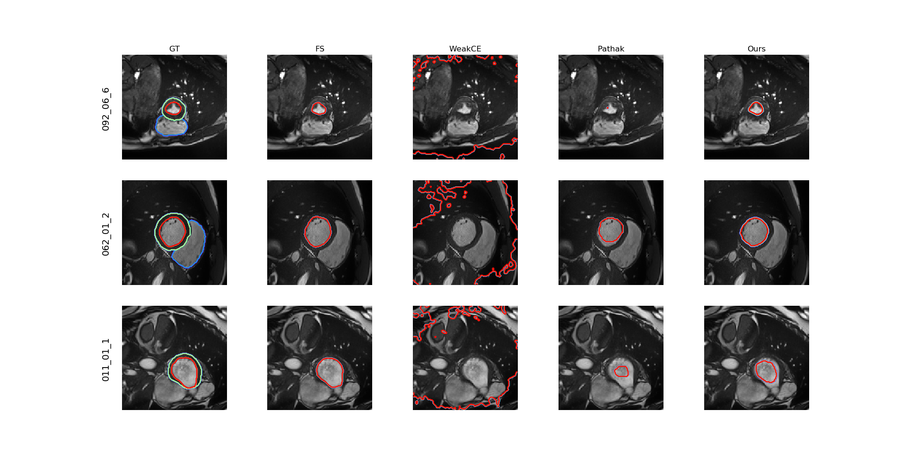
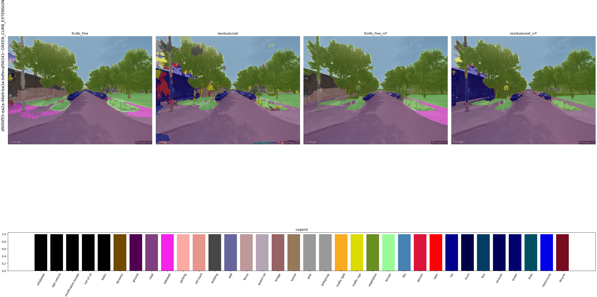

# Segmentation viewer
A really simple tool to visualize different segmentations on a dataset.
The idea is to sample images and the associated results (for instance: ground truth, alg, alg2).
By clicking inside the window (left click), it will go to the next batch of images. Right click to go to the previous one.



You can specify the regex in `patient_id` to regroup the images by id. By default, it will regroup images per name.

By default, it will draw contours of the segmentation, but it can be disabled and draw a transparent mask overlay instead (`--no_contour`).

The display names are useful to have better columns names, instead of the complete folder name (`--display_names option`).

It handles of the shelf both multi-class and continuous (probabilities map) as segmentation inputs, but can easily be tweaked for each application.

```zsh
>>> ./viewer.py --help
usage: viewer.py [-h] --img_source IMG_SOURCE [-n N] [--seed SEED] [--crop CROP] [-C C] [--alpha ALPHA] [--id_regex ID_REGEX] [--display_names [DISPLAY_NAMES ...]]
                 [--class_names [CLASS_NAMES ...]] [--remap REMAP] [--no_contour] [--legend]
                 [--cmap {Blues,BrBG,BuGn,BuPu,CMRmap,GnBu,Greens,Greys,OrRd,Oranges,PRGn,PiYG,PuBu,PuBuGn,PuOr,PuRd,Purples,RdBu,RdGy,RdPu,RdYlBu,RdYlGn,Reds,Spectral,Wistia,YlGn,YlGnBu,YlOrBr,YlOrRd,afmhot,autumn,binary,bone,brg,bwr,cool,coolwarm,copper,cubehelix,flag,gist_earth,gist_gray,gist_heat,gist_ncar,gist_rainbow,gist_stern,gist_yarg,gnuplot,gnuplot2,gray,hot,hsv,jet,nipy_spectral,ocean,pink,prism,rainbow,seismic,spring,summer,terrain,winter,Accent,Dark2,Paired,Pastel1,Pastel2,Set1,Set2,Set3,tab10,tab20,tab20b,tab20c,cityscape}]
                 [folders ...]

Display the requested data.

positional arguments:
  folders               The folder containing the source segmentations.

optional arguments:
  -h, --help            show this help message and exit
  --img_source IMG_SOURCE
                        The folder containing the images (display background).
  -n N                  The number of images to sample per window.
  --seed SEED           The seed for the number generator. Used to sample the images. Useful to reproduce the same outputs between runs.
  --crop CROP           The number of pixels to remove from each border.
  -C C                  Number of classes. Useful when not all of them appear on each images. (e.g., 5 classes segmentation but samples contains only classes 0 1 3.)
  --alpha ALPHA
  --id_regex ID_REGEX   The regex to extract the image id from the images names. Required to match the images between them. Can easily be modified to also handle .jpg
  --display_names [DISPLAY_NAMES ...]
                        The display name for the folders in the viewer. If not set, will use the whole folder name.
  --class_names [CLASS_NAMES ...]
                        Give names to classes, useful for multi-organs segmentation.
  --remap REMAP         Remap some mask values if needed. Useful to suppress some classes.
  --no_contour          Do not draw a contour but a transparent overlap instead.
  --legend              When set, display the legend of the colors at the bottom
  --cmap {Blues,BrBG,BuGn,BuPu,CMRmap,GnBu,Greens,Greys,OrRd,Oranges,PRGn,PiYG,PuBu,PuBuGn,PuOr,PuRd,Purples,RdBu,RdGy,RdPu,RdYlBu,RdYlGn,Reds,Spectral,Wistia,YlGn,YlGnBu,YlOrBr,YlOrRd,afmhot,autumn,binary,bone,brg,bwr,cool,coolwarm,copper,cubehelix,flag,gist_earth,gist_gray,gist_heat,gist_ncar,gist_rainbow,gist_stern,gist_yarg,gnuplot,gnuplot2,gray,hot,hsv,jet,nipy_spectral,ocean,pink,prism,rainbow,seismic,spring,summer,terrain,winter,Accent,Dark2,Paired,Pastel1,Pastel2,Set1,Set2,Set3,tab10,tab20,tab20b,tab20c,cityscape}

```

---
It nows support the colormap argument, including the cityscape colors. For instance:
```zsh
python3.9 viewer.py  -n 1 -C 34 --img_source data/gsv_images results/cityscapes/fcn8s_fine/gsv_pred/iter000 results/cityscapes/residualunet/gsv_pred/iter000 results/cityscapes/fcn8s_fine/gsv_pred_crf/iter000 results/cityscapes/residualunet/gsv_pred_crf/iter000 \
	--display_names fcn8s_fine residualunet  fcn8s_fine_crf residualunet_crf --no_contour --cmap cityscape \
	--legend
```


I also added the `--legend` option, to display the discretized colors legend at the bottom of the plot ; this is most useful for results with many different classes, such as Cityscape.

Adding the colormap for PascalVOC for instance would be quite easy.

---

Things to add:
* Remove all the wasted space around the plots